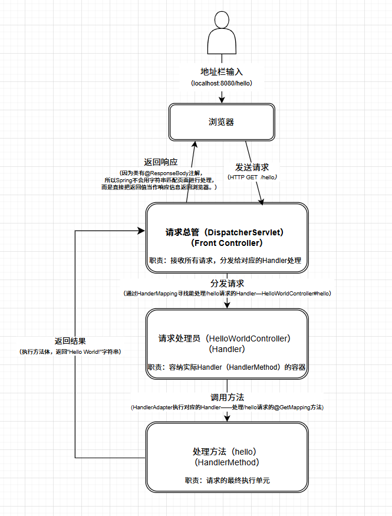
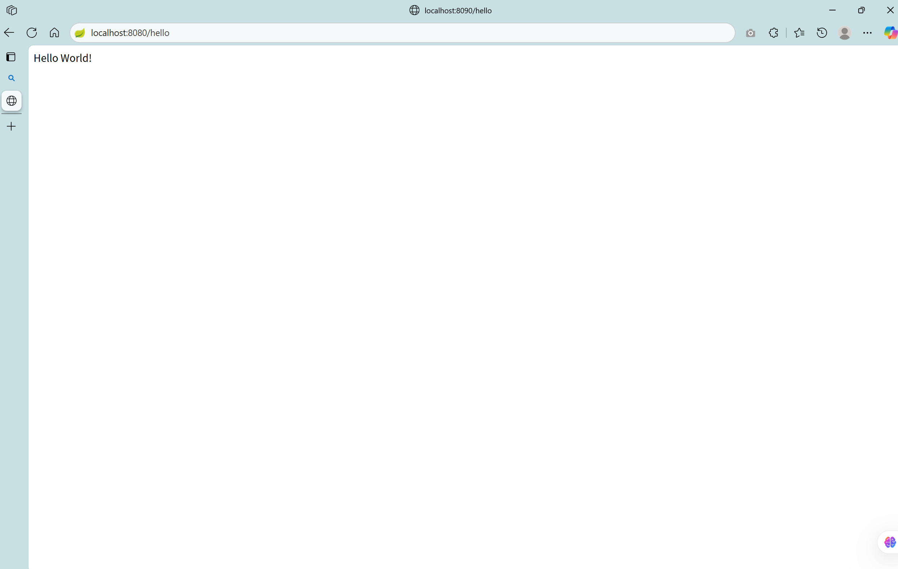
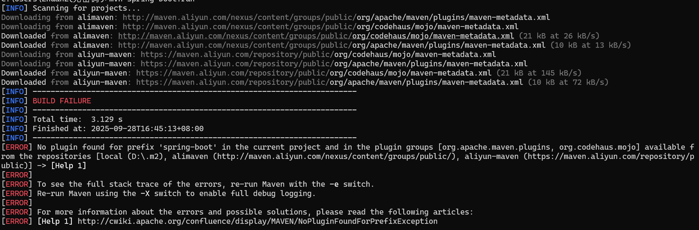

### 📍项目简介

这是你迈向Spring Boot开发的第一步。本项目将带你用最少的代码，启动一个真正的Web服务。你将亲手搭建一个可以通过浏览器访问，并能返回“Hello, World!”信息的后端应用，体验从0到1的创造快乐。

### 🎉你将获得

- **快速启动一个Web服务的能力**：掌握创建Spring Boot项目、添加依赖、编写启动类和控制器的标准流程。
- **对Spring MVC处理Web请求的具象化理解**：通过流程图和代码，你将不再对“浏览器如何与后台交互”感到神秘，而是能清晰地洞察Spring MVC框架内部的核心工作流。
### 🤖技术栈一览

  
- **核心框架**：Spring Boot, Spring MVC
- **构建工具**：Maven
### 📖知识介绍

#### 控制器：你的API服务员

- **`@RestController`**: 这是个复合注解，它向Spring宣告：“这个类是专门用来处理网络请求的控制器，并且我的所有方法都默认直接返回一个字符串，而不是跳转到一个页面”。它由两部分组成：
    - `@Controller`: 标记这个类是一个控制器，需要Spring扫描并管理。
    - `@ResponseBody`: 这是前后端分离项目中API的典型做法。它告诉Spring：“不要把我的返回值（例如“Hello World!”）当作页面去解析。请直接把我的内容通过内部转换器（`HTTPMessageConverter`），写入HTTP的响应体返回浏览器”。
- **`@GetMapping`**: 就像是给服务分发机器人编码任务，它告诉Spring：“如果有路径是`/hello`的GET请求，就让我注解的方法来处理”。

#### 浏览器访问项目的流程

当你在浏览器地址栏输入地址并按下回车后，一个请求就踏上了旅程。它并非直接到达你的代码，而是经过一场由Spring MVC精心组织的接力赛。下面流程图详细描绘了这场旅程中的每一个关键角色和步骤：

**总结一下**：整个流程的核心是请求总管（DispatcherServlet），它就像一个总指挥，负责接收所有的请求，并通过HandlerMapping查找到正确的处理方法（HandlerMethod），再交给HandlerAdapter去执行，最后把这个方法的处理结果返回给用户。理解了这个流程，你就掌握了Spring MVC的脉搏。
### 🚀快速开始

1. **环境准备:** 确保你已安装 Java 17+ 和 Maven。
2. **启动项目:** 
	- **方式一（推荐）**：直接在你的IDE中运行 `Application` 主类的 `main` 方法。
- **方式二（命令行）**：打开终端，进入本项目根目录，执行 `mvn spring-boot:run` 命令。
3. **访问验证:** 打开浏览器，访问地址 `http://localhost:8080/hello`。
4. **预期结果:** 你将在浏览器页面上看到 "Hello World!" 字符串。
   
### ❓常见问题

Q：为什么我执行`mvn spring-boot`命令后，控制台显示：`mvn` 不是内部或外部命令，也不是可运的程序或批处理文件？ 
A： 首先确认maven是否安装，是否正确加入环境变量。

Q：为什么我执行`mvn spring-boot`命令后，控制台显示：BUILD FAILURE ？具体如下： 

A：查看控制台当前地址是否项目主目录（原因是项目没有找到`spring-boot`插件，但是项目中存在此插件。）
