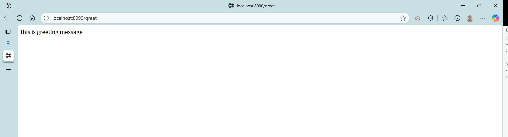

### 📍项目简介
恭喜你完成了第一个实现快速启动的Web项目。接下来，你会掌握如何让项目按照自己的心意去启动和运行，这将赋予你灵活掌控项目的能力，即刻开始行动吧！

### 🎉你将获得
**驾驭框架配置**：你将通过配置驾驭Spring Boot的启动和运行。
**解耦配置与代码**：你将轻松实现分离配置与代码，告别硬编码。
**掌握优先级规则**：你将洞悉配置优先级法则，游刃有余地管理复杂配置场景。

### 🤖技术栈一览

  
- **核心框架**：Spring Boot, Spring MVC
- **构建工具**：Maven

### 📖知识介绍

#### 配置定义
> Spring Boot的核心思想是“约定大于配置”，常用配置遵守约定俗成的规则设置默认值。大部分情况下我们可以不管配置文件直接使用（这就是我们的项目可以快速启动的原因），但是某些情况还是需要按照需求修改配置。

**框架定义配置**：用于项目级配置、数据源配置、中间件配置等，告诉框架我们要如何启动运行项目。
- 步骤：设置指定配置，这会告诉Spring：”这个配置不要用默认值了，用我设置的这个值去启动和运行项目“。例如server.port配置，是告诉SpringBoot：“启动后，记得要以这个端口号作为访问入口”。
- 注意：严格按照框架定义配置规定书写，否则配置会无效。

**自定义配置**：用于自定义配置管理、使用，快速实现配置与代码分离。
- 步骤一：设置一个（与框架定义配置不一样的）配置，这会告诉Spring Boot：“在加载配置时，把我定义的配置也保存起来，方便之后使用。”。例如greeting.message配置，是告诉Spring Boot：”保存好我设置好的greeting.message，方便之后使用“。
- 步骤二：然后使用@Value注解，这会告诉Spring：”我这里需要使用这个配置，在容器加载时，把配置值注入进来！“。例如@Value(”${greeting.message}“)注解，告诉Spring Boot：”我标记的变量需要注入这个名为greeing.message的配置的值，你在加载类时把保存好的配置值放进变量中“。
- 最佳实践：给你的自定义配置添加一个统一的前缀（如`app.`或`greeting.`），这不仅能避免与框架内置配置产生冲突，还能让配置结构一目了然，极大地提高了可维护性。

#### 配置优先级
项目存在多个配置文件时，需要一个固定的规则去组织管理这些配置文件。从下图我们可以快速了解如何实现配置的精准管理：

### 🚀快速开始
1. **环境准备:** 确保你已安装 Java 17+ 和 Maven。
2. **启动项目:** 
	- **方式一（推荐）**：直接在你的IDE中运行 `Application` 主类的 `main` 方法。
- **方式二（命令行）**：打开终端，进入本项目根目录，执行 `mvn spring-boot:run` 命令。
3. **访问验证:** 
	- **执行步骤**：打开浏览器，访问地址 `http://localhost:8090/hello`。
- **预期结果**：你将在浏览器页面上看到 "Hello World!" 字符串。

### 🔬动手实验
1. **自定义配置验证**：
    - **执行步骤**：打开浏览器，访问地址`http://localhost:8090/greet`
    - **预期结果**：你将在浏览器页面上看到"this is greeting message"字符串。
    - 
2. **properties、yml优先级验证**：
    - **执行步骤一**：在项目内创建`application.properties`文件，输入`server.port=8080`配置。
    - 
    - **执行步骤二**：打开浏览器，访问地址`http://localhost:8090/hello`
    - **预期结果**：无法访问页面
    - 
    - **执行步骤三**：打开浏览器，访问地址`http://localhost:8080/hello`
    - **预期结果**：你将在浏览器页面上看到 "Hello World!" 字符串。
3. **多配置优先级验证**：
    - **执行步骤一**：打开终端，执行`mvn spring-boot:run -Dspring-boot.run.arguments="--server.port=8081"`命令
    - **预期结果**：成功启动项目
    - 
    - **执行步骤二**：打开浏览器，访问地址`http://localhost:8080/hello`
    - **预期结果**：无法访问页面
    - **执行步骤三**：打开浏览器，访问地址`http://localhost:8081/hello`
    - **预期结果**：你将在浏览器页面上看到 "Hello World!" 字符串。

### ❓常见问题

Q：为什么我按照步骤创建了`application.properties`文件，但是原来的`:8090`端口依然可以访问？ 
A：
- 查看`application.properties`创建是否合法，例如：名字是否一致，位置是否在application.yml同一个文件夹。
- 查看配置信息是否正确填写，例如：配置名`server.port`是否有误

Q：为什么我执行`mvn spring-boot:run -Dspring-boot.run.arguments="--server.port=8081"`命令报错？ 
A：
- 首先查看命令是否正确输入，`-Dspring-boot.run.arguments="--server.port=8081"`中，特别注意，``-Dspring-boot.run.arguments`不能写错，且配置定义都要写在双引号中。
- 然后确认maven是否正确配置，参考[module-01-web-helloworld项目的`README.md`文档](../module-01-web-helloworld/README.md)
- 查看是否在另一个控制台或者IDE中启动了项目，出现端口占用问题

Q：为什么在执行`mvn spring-boot:run -Dspring-boot.run.arguments="--server.port=8081"`命令成功后，8090、8081端口都能访问页面？ 
A：查看是否在另一个控制台或者IDE中启动了其它端口的

Q：为什么`mvn spring-boot:run -Dspring-boot.run.arguments="--server.port=8081"`命令执行成功后，8080访问有效，反而8081访问无效。 
A：查看命令是否正确输入，`-Dspring-boot.run.arguments="--server.port=8081"`中，双引号中的配置定义的`--`符号不能省略